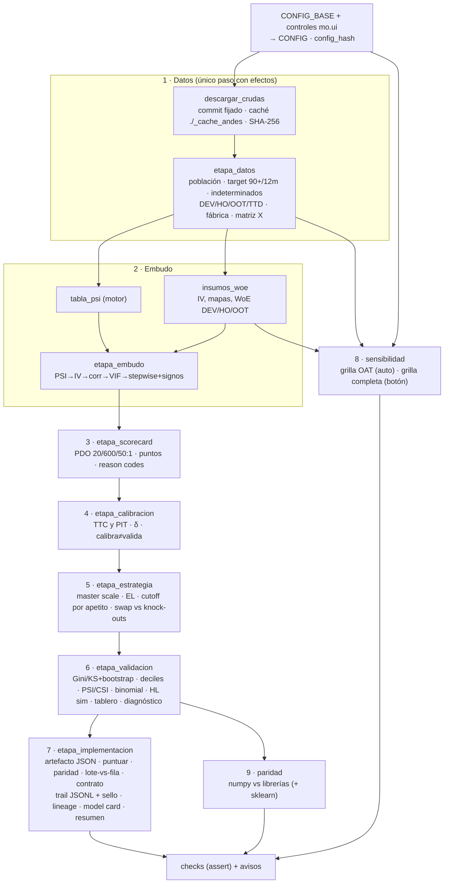

# C2 · El scorecard como pipeline declarativo sobre Financiera Andes

> **Ficha.** Proyecto integrador de la Serie 2. Integra las clases 3 a 6 y los Labs 2 y 3 (Financiera Andes) en una sola corrida reproducible. · **Prerrequisitos:** Serie 1 · M2–M5 (t₀, target, esquema muestral, fábrica declarativa), M7 (WoE/IV); Serie 2 · M08–M23 (cada etapa tiene su módulo, ver tabla 4.1). · **Archivos:** `C2_integrador_andes.py` (notebook Marimo; descarga los datos con commit fijado y corre completo en unos 50 s con la grilla reducida) y este documento. · **Tiempo estimado:** 3–4 h (lectura, ejecución, variación de controles y ejercicios de extensión).

---

## 1. Qué integra este proyecto (y qué agrega a los labs)

Los Labs 2 y 3 recorrieron el ciclo completo sobre Financiera Andes, pero repartido en celdas que el alumno edita: el embudo y el scorecard en el Lab 2, y en el Lab 3 la calibración, la estrategia, la validación y la implementación. Cada lab reconstruía la matriz desde cero, fijaba umbrales en el cuerpo del código y dejaba las decisiones como texto (`LECTURA_…`). Ese formato sirve para aprender. En producción no alcanza, porque la misma corrida no se puede repetir, auditar ni variar sin tocar el código.

Este integrador reescribe el mismo ciclo como un **pipeline declarativo**:

1. **Una sola configuración** (`CONFIG_BASE`, un dict con forma de YAML) contiene todas las decisiones: fuente de datos con commit y SHA-256, semilla, ventanas, umbrales del embudo, escala, ancla de calibración, apetito, supuestos de LGD/EAD, umbrales del tablero, tolerancias del contrato y la grilla de sensibilidad. Su huella (`config_hash`, SHA-256 del JSON canónico) identifica la corrida.
2. **Funciones puras por etapa.** Cada etapa recibe `(config, insumos, motor)` y devuelve un dict de artefactos más una lista de **eventos**. Esos eventos alimentan el audit trail. El único paso con efectos (red y disco) es la descarga, y está aislado.
3. **Dos motores intercambiables.** `numpy` es la implementación propia (IRLS, AUC por rangos, KS, VIF por inversa de la correlación, δ por Newton, binomial exacta, gamma incompleta para la χ²). `librerias` usa statsmodels, scipy y scikit-learn. Un **arnés de paridad** corre ambos y exige mismas decisiones y números dentro de tolerancia.
4. **La población completa** (sin el submuestreo personal de 60%), salvo que se ingrese el correo del lab. En ese caso se reproduce la muestra personal con la misma semilla.
5. **Una grilla de sensibilidad** que re-ejecuta el embudo variando las convenciones del curso y mide cuánto cambian las variables, el Gini y el cutoff.

**Lo que el curso dejó como convención y aquí queda explícito en la config.** Estos valores son elecciones, no leyes. El integrador los declara para poder variarlos:

- Umbral PSI 0,25 contra TTD y la regla «PSI no medible ⇒ fuera» (clase 3). Ambos son convenciones sin base inferencial (M08).
- IV ≥ 0,10, |ρ WoE| ≤ 0,70, VIF ≤ 10, α = 0,05 de entrada y salida, tope de 14 variables (clase 3). Todos son reglas prácticas (M09, M11).
- Cinco bins por cuantiles con la moda aparte si concentra más de 35% (`binear()` de la clase 2).
- La política de signos: β > 0 sobre WoE ⇒ la variable se excluye (Lab 2 §5).
- El ancla de calibración (TTC contra PIT) y **qué ventana** define la tendencia central (clases 4–5).
- El apetito de riesgo (mora máxima, aprobación mínima), la LGD de 45% y EAD = monto solicitado (clase 5). Son supuestos de negocio, no estimaciones.
- Los umbrales 🟡/🔴 del tablero (clase 5).

**Lo que el integrador no hace** (y queda como extensión, sección 11): reject inference (Serie 1 · E1), binning óptimo con restricciones de monotonía (M14), calibración de forma (δ₀ + δ₁·logit, M15), CUSUM de monitoreo (M20) y sellado de tiempo con un tercero (M22).

---

## 2. Arquitectura

### 2.1 Diagrama de etapas

Cada flecha es un **valor inmutable**: ninguna etapa modifica lo que recibe, solo produce un dict nuevo. Por eso el mismo `datos` alimenta dos corridas (una por motor) y siete u ocho corridas de sensibilidad sin interferencias.

### 2.2 Principios de diseño

- **Pureza y un solo borde con efectos.** `descargar_crudas` es la única función que toca red o disco. Si no hay red ni caché, la celda llama a `mo.stop` con un mensaje y no se ejecuta ninguna etapa posterior (sin traceback). Si el SHA-256 de un archivo no coincide con el de la config, se borra la copia local y la corrida también se detiene. La fuente queda bajo contrato, igual que la matriz.
- **La config es la receta completa.** Todo lo que cambia un número del resultado vive en la config. El código implementa métodos, no parámetros. El `config_hash` cambia con cualquier umbral, ventana o supuesto.
- **Los eventos son datos.** Cada etapa emite `{paso, evento, payload}` con las decisiones que tomó: variables fuera por PSI con su valor, descartes por correlación con la variable que los desplazó y su ρ, entradas y salidas del stepwise con su p, exclusiones por signo, δ con su ventana, cutoff con el apetito que lo justificó y estados del tablero. La etapa 7 los encadena en el trail. Un validador puede reconstruir el embudo leyendo el JSONL, sin ejecutar el código.
- **Motores como inyección de dependencias.** `MOTORES["numpy"]` y `MOTORES["librerias"]` exponen la misma interfaz (`logit`, `auc`, `ks`, `vif`, `delta`, `binom_p`, `chi2_sf`, `psi`). Las etapas no saben cuál reciben.
- **El artefacto es la frontera.** Hacia atrás de la frontera todo puede mirar DEV. Hacia adelante, `puntuar(df, artefacto)` solo conoce el JSON (clase 6: «en producción NO existe DEV»).

### 2.3 Reactividad: por qué `cfg_datos` es una celda aparte

En Marimo, una celda se re-ejecuta cuando cambia cualquier variable que lee. Si la etapa de datos leyera `CONFIG`, mover el umbral de correlación reconstruiría la matriz (unos 7 s) sin necesidad. Por eso la sección `datos` se deriva en su propia celda (`cfg_datos`), que depende solo de `ID_ALUMNO`, y `CONFIG` la incorpora después. Es el mismo principio que un DAG de datos con caché por nodo: la invalidación sigue a las dependencias declaradas, no al archivo entero. `ID_ALUMNO` se ingresa por formulario (`.form()`) para no re-ejecutar en cada tecla.

---

## 3. El contrato de configuración

| Sección · campo | Valor por defecto | Naturaleza | Quién lo fija | Módulo |
|---|---|---|---|---|
| `datos.commit`, `datos.sha256` | `feaa1968…`, 4 hashes | Dato fijado (versión de la fuente) | Datos / Modelos | M21, M22 |
| `datos.id_alumno` | vacío | Parámetro de muestra | Usuario | — |
| `datos.sal_semilla`, `frac_muestra_personal` | `ANDES-C1-2026-B`, 0,60 | Convención del curso | Curso | Serie 1 · M4 |
| `datos.periodo_modelacion`, `ultima_cosecha_dev_ho`, `inicio_ttd`, `frac_dev` | 2024-09…2025-06, 2025-01, 2025-07, 0,75 | Diseño muestral | Modelador | Serie 1 · M2, M4 |
| `datos.horizonte_meses`, `dpd_malo`, `dpd_indeterminado` | 12, 90, 30 | Definición de default | Riesgo / norma interna | Serie 1 · M3 |
| `embudo.psi_bins`, `psi_eps`, `psi_max_ttd`, `psi_no_medible` | 10, 1e-4, 0,25, excluir | Convención | Modelador | M08 |
| `embudo.iv_min`, `bins_woe`, `umbral_moda` | 0,10, 5, 0,35 | Convención | Modelador | Serie 1 · M7, M11 |
| `embudo.corr_max`, `vif_max` | 0,70, 10 | Convención | Modelador | M09 |
| `embudo.alpha_*`, `max_variables`, `politica_signos` | 0,05, 14, excluir_y_reiniciar | Convención | Modelador | M10, M11 |
| `scorecard.*` | PDO 20, 600, 50:1, 3 motivos | Convención corporativa | Riesgo | M13, M14 |
| `calibracion.ancla`, ventanas TTC/PIT, `muestra_validacion` | ttc, 2024-09…2025-01, 2025-02…2025-06, OOT | Decisión de modelación | Modelador + validador | M15, M19 |
| `estrategia.cortes_banda`, `etiquetas_banda` | 540…660, E…A1 | Convención corporativa | Riesgo | M16 |
| `estrategia.lgd`, `ead`, `mora_max`, `aprobacion_min` | 0,45, monto, 8%, 60% | **Supuesto de negocio** | Comité / Directorio | M17 |
| `estrategia.knockouts` | mora interna vigente o ≥ 30 días en el sistema | Política vigente | Crédito | M18 |
| `validacion.B_bootstrap`, semillas, `hl_*` | 1.000, 20260916/17, 10 grupos, 10.000 sim. | Parámetro técnico | Validador | M12, M19 |
| `validacion.umbrales` | 20%/30%, 0,30/0,20, 0,10/0,25, 0,05/0,01, +3/+6 pts | Política de monitoreo | Comité | M20 |
| `implementacion.*` | tolerancias del contrato, `tol_paridad` 1e-9 | Política operativa | Producción + Modelos | M21 |
| `sensibilidad.*` | grilla de 48 combinaciones | Diseño del análisis | Modelador | este módulo |

**Tres reglas del contrato.**

1. **Nada fuera de la config cambia un resultado.** Si un número del informe cambia entre dos corridas con el mismo `config_hash` y el mismo `data_hash`, eso es un bug de motor, no un cambio de modelo. El arnés de paridad lo pondría en evidencia.
2. **Los supuestos de negocio se distinguen de las convenciones técnicas.** Mover el apetito no reentrena nada, pero cambia la decisión. Por eso va en la config y en el trail, con dueño. En un repositorio real, el bloque `estrategia` tendría su propio archivo y su propio ciclo de aprobación (M17: el apetito lo firma el comité).
3. **Semver sobre la config** (M22): cambiar δ o cutoff es *minor* con acta; cambiar variables, cortes o target es *major* con validación completa; un cambio que no mueve ninguna salida es *patch* con prueba de paridad.

**Qué se omitió a propósito de la config.** El `umbral_moda` de `binear` está en la config pero no en los controles: es parte del método del curso y moverlo cambia la partición de variables con masa en un valor. La fórmula de puntos (reparto del intercepto β₀/n) tampoco es configurable, porque no afecta el score, solo la presentación de la tabla (M13).

---

## 4. Etapa por etapa

### 4.1 Mapa: qué hace, qué decide, qué evento deja

| # | Función | Decide | Eventos al trail | Módulo que profundiza |
|---|---|---|---|---|
| 1 | `descargar_crudas`, `etapa_datos` | Muestra (completa o personal), población, target, muestras, matriz | `fuentes_verificadas`, `muestra_definida`, `matriz_construida` (con `hash_matriz`) | Serie 1 · M2–M5 |
| 2a | `tabla_psi`, `insumos_woe` | — (insumos cacheables) | — | M08, Serie 1 · M7 |
| 2b | `etapa_embudo` | Fuera por PSI y no medibles, filtro IV, greedy de correlación, VIF, stepwise, signos | `psi`, `iv`, `correlacion`, `vif`, `stepwise_*`, `signo_excluida`, `modelo_ajustado` | M08, M09, M10, M11 |
| 3 | `etapa_scorecard` | Escalado, tabla de puntos, reason codes | `escalado` | M13, M14 |
| 4 | `etapa_calibracion` | δ TTC y δ PIT, ancla vigente, circularidad | `delta_estimado` | M15 |
| 5 | `etapa_estrategia` | Master scale, cutoff por apetito, swap-set a igual aprobación | `master_scale`, `cutoff_recomendado`, `swap_set` | M16, M17, M18 |
| 6 | `etapa_validacion` | Métricas con IC, estabilidad, backtesting, tablero, diagnóstico | `discriminacion`, `estabilidad`, `backtesting`, `tablero` | M12, M19, M20 |
| 7 | `etapa_implementacion` | Artefacto, paridad, contrato, trail, lineage, card, resumen | `artefacto_congelado`, `paridad_verificada`, `lote_recibido`, `contrato_validado`, `artefacto_cargado`, `lote_puntuado`, `corrida_terminada` | M21, M22 |
| 8 | `correr_grilla` | — (análisis) | — | M11, este módulo |
| 9 | `comparar_corridas` | — (control) | — | M23 |

### 4.2 Decisiones de implementación que no son obvias

**Datos.** La preparación es el código del Lab 2 **literal**, con sus constantes movidas a la config. Con `ID_ALUMNO` vacío no hay submuestreo. Aun así, la partición DEV/HO al azar necesita una semilla. Se usa la misma fórmula del lab con el ID vacío (`sha256("ANDES-C1-2026-B|")` → 148.689) y se declara. El Lab 3 usó otra ventana (2024-07…2025-06) y leía `main` en vez del commit. El integrador reproduce el Lab 2, y el ejercicio 11.1 muestra cómo pasar a la ventana del Lab 3 cambiando solo la config.

**PSI y la regla de no medibles.** `psi_curso` replica el `psi()` de la clase 3: deciles de DEV, +1e-4 y `NaN` cuando `np.unique` deja menos de 3 cortes por la masa de ceros. En Andes, las variables no medibles son de mora corta (`dias_mora_max_3m`, `dias_mora_prom_3m`, `n_meses_mora_3m`, `dias_mora_ult`) y `peor_mora_sistema_ult`. Varias tienen IV alto (0,45 a 0,61). El notebook las reporta aparte con su IV, como exige el lab: un descarte silencioso es indefendible. M08 §5.3 muestra cómo hacerlas medibles (bin para la moda + deciles del resto).

**Stepwise.** Implementa la receta del Lab 2: entra la candidata con mayor log-verosimilitud entre las de p < α. Tras cada entrada, sale **la peor** si alguna perdió significancia y se re-estima antes de volver a mirar. El proceso termina al llegar a 14 variables o cuando ninguna candidata aporta. Hay dos agregados declarados. (i) Una variable que sale en la revisión vuelve al pool de candidatas. (ii) Una **guarda anti-ciclo**: si el conjunto de elegidas se repite, el proceso se detiene y lo registra. En Andes la guarda no se activó en ninguna de las 48 corridas de la grilla, pero sin ella un `while` con reingreso puede no terminar.

**Política de signos.** Si el modelo final tiene algún β > 0, se excluye la variable con el β **más positivo** (una por vez) y se re-corre el stepwise completo. Sacar todas las positivas de golpe usa información obsoleta, igual que sacar varias no significativas de golpe. Con la config base no hubo exclusiones. En la grilla completa hubo exclusiones en 5 de 48 corridas.

**Calibración.** Las dos anclas se calculan siempre y la config elige cuál se usa:

- **TTC**: el objetivo es el **promedio simple** de las tasas mensuales de las cosechas de la ventana, la receta de la demo de clase 5. δ resuelve $\frac{1}{n}\sum_i \sigma(\ell_i+\delta) = \text{TC}$ sobre los casos de esa ventana.
- **PIT**: el objetivo es la **tasa agregada** del periodo reciente, la receta de la clase 4 v2.1. δ se resuelve sobre los casos de esa ventana.

La etapa registra qué muestras caen en la ventana de calibración y marca `circular = True` si la muestra de validación está entre ellas.

**Cutoff.** La regla es declarativa: se elige el **corte más generoso** (el menor score) que cumple a la vez `mora_observada ≤ mora_max` y `aprobación ≥ aprobacion_min` en la muestra de estrategia. Si ningún corte cumple ambos, el estado queda como **CONFLICTO de apetito**: se prioriza la mora y se reporta que la aprobación queda bajo el mínimo. Probado con mora 3% y aprobación 80%, el resultado es un cutoff de 590 y el conflicto queda escrito en el trail. Un conflicto no es un error del modelo. Es información para el comité: el apetito declarado es incompatible con esta cartera.

**Diagnóstico por patrón.** El tablero agrupa los indicadores en tres familias: **ranking** (Gini, KS), **población** (PSI, CSI, mix) y **calibración** (binomial global, bandas, HL, swap-in). El diagnóstico sale del peor color de cada familia y de si el binomial global está en rojo:

- ranking 🔴 → re-desarrollo;
- ranking sano + calibración 🔴 con global 🔴 → descalibración de **nivel** → recalibrar δ;
- calibración 🔴 con global aceptable → descalibración de **forma** → revisar la master scale por tramo;
- solo amarillos → vigilancia reforzada;
- población → rastrear el origen con CSI antes de actuar.

Cada rama declara también **qué no hacer** y **quién firma**. La lógica sigue la jerarquía de la clase 5 (vigilar → recalibrar → re-desarrollar → contingencia). No reemplaza al juicio del comité: le entrega el patrón armado y verificable.

**Bug A emulado.** `puntuar_con_bug_a` re-ajusta los cuantiles con el lote TTD y asigna el WoE de DEV **por posición del bin**. Es la forma más común de este error: se «reusa» la tabla de WoE, pero con cortes recalculados. Es una emulación, no el código exacto con el que la clase reprodujo los 587 casos de Austral.

---

## 5. Resultados sobre Financiera Andes (población completa)

Todos los números salen de la corrida con la config por defecto (`motor = numpy`, `ID_ALUMNO` vacío). El motor `librerias` da exactamente las mismas decisiones (sección 7).

### 5.1 Datos y muestras

| Muestra | n | Malos | Tasa | Cosechas |
|---|---:|---:|---:|---|
| DEV | 3.150 | 304 | 9,65% | 2024-09 … 2025-01 (75% al azar) |
| HO | 1.066 | 110 | 10,32% | 2024-09 … 2025-01 (25% al azar) |
| OOT | 3.452 | 494 | 14,31% | 2025-02 … 2025-06 |
| TTD | 14.123 | — | — | 2025-07 … 2026-06 |

La matriz tiene 22.616 filas y **92 candidatas** (Austral tenía 108). Quedan fuera 825 indeterminados de 30 a 89 DPD. El dato que ordena todo lo demás es el **deterioro por cosecha**: la tasa de malos sube de 8,7% (2024-09) a 16,5% (2025-05) y 16,2% (2025-06). La OOT es una muestra de otra época de riesgo, no solo «otra muestra».

### 5.2 Embudo: 92 → 79 → 55 → 25 → 25 → 9

- **PSI contra TTD.** 8 variables salen por PSI > 0,25 y 5 no son medibles. La variable plantada del Lab 2 es **`canal`**: PSI contra TTD de 0,731 (contra OOT, apenas 0,116) e IV de 0,0005. No aporta señal y la población se movió. También salen `saldo_consumo_prom_12m` (0,298), `deuda_interna_prom_12m` (0,306), `pagos_6m/12m` (0,29/0,35) y `facturacion_3m/6m/12m` (0,26–0,36). Son variables en pesos: con inflación y crecimiento de saldos, los deciles de DEV quedan chicos. Casi ninguna se ve inestable contra OOT (PSI < 0,03), lo que confirma la lección de la clase 3: **TTD detecta lo que OOT todavía no muestra**.
- **IV ≥ 0,10.** Pasan 55. Hay 24 pares con |ρ WoE| > 0,90.
- **Correlación greedy ≤ 0,70.** Quedan 25. El registro de descartes responde la pregunta de comité «¿por qué no está X?» con una línea. Por ejemplo, `cupo_linea_ult` sale por ρ = 0,879 con `abonos_prom_12m`, `renta_liquida` por ρ = 0,806 con la misma, y `n_meses_mora_6m` por ρ = 0,889 con `meses_desde_mora_12m`.
- **VIF.** El máximo es 4,31 (`abonos_prom_12m`) y nada sale. Como en Austral (26 → 26), el paso de correlación ya resolvió la colinealidad. Igual se reporta: ausencia de evidencia no es evidencia de ausencia.
- **Stepwise.** Entran 9 variables en 9 pasos, sin salidas ni exclusiones por signo.

### 5.3 El modelo

| Variable | β (DEV) | p | β re-estimado en HO | p (HO) | IV |
|---|---:|---:|---:|---:|---:|
| const | −2,282 | <0,001 | −2,156 | <0,001 | — |
| uso_linea_prom_12m | −0,516 | <0,001 | −0,580 | <0,001 | 1,637 |
| meses_desde_mora_12m | −0,604 | <0,001 | −0,846 | <0,001 | 0,386 |
| uso_tc_prom_6m | −0,342 | <0,001 | −0,253 | 0,064 | 1,351 |
| peor_mora_sistema_12m | −0,428 | <0,001 | −0,267 | 0,126 | 0,442 |
| abonos_prom_12m | −0,453 | <0,001 | −0,250 | 0,138 | 0,675 |
| tipo_empleo | −0,783 | <0,001 | **+0,240** | 0,486 | 0,111 |
| antiguedad_meses | −0,837 | <0,001 | −0,204 | 0,573 | 0,101 |
| consultas_12m | −0,408 | <0,001 | −0,088 | 0,663 | 0,367 |
| edad | −0,428 | 0,011 | −0,284 | 0,299 | 0,189 |

Todos los β en DEV son negativos, como exige la convención WoE alto = bin bueno. Comparado con la lista de referencia de la corrida docente del Lab 3, se comparten 7 variables. Cambian `cupo_linea_ult`, que aquí cae por correlación con `abonos_prom_12m`, y se agregan `abonos_prom_12m` y `tipo_empleo`. Esa lista se construyó con otra ventana y con la muestra de 60%, así que la diferencia es esperable. La sección 6 muestra que es del mismo orden que la que producen las convenciones.

**Dos lecturas para el informe.**

1. **`tipo_empleo` invierte su signo al re-estimar en HO**, pero con p = 0,49. Es una estimación indistinguible de cero en una muestra de 1.066 casos y 110 malos, no una inversión significativa. Se reporta sin excluir (Lab 2 §6c: HO sirve para *contrastar*, no para *re-estimar*). La caída de los β en HO también es general: 7 de 9 son menores en magnitud. Es el optimismo de selección del stepwise (M11) y la razón por la que DEV no es la métrica.
2. **`edad` entra al modelo y puede aparecer como reason code.** En varias jurisdicciones su uso como motivo de rechazo está restringido. En Chile hay que verificarlo con la normativa aplicable y con asesoría legal (M14 discute la pregunta «¿puede la edad ser reason code?»). El integrador la marca en el texto del motivo.

### 5.4 Scorecard

factor = 28,8539, offset = 487,1229, 42 filas de variable × bin. Rango de puntos por variable: `uso_linea_prom_12m` 61,3 · `uso_tc_prom_6m` 43,8 · `abonos_prom_12m` 32,6 · `meses_desde_mora_12m` 29,5 · `tipo_empleo` 27,2 · `antiguedad_meses` 23,6 · `consultas_12m` 20,0 · `peor_mora_sistema_12m` 18,0 · `edad` 16,6.

El orden por rango no coincide con el orden por |β|. `antiguedad_meses` tiene el β más grande (−0,84) pero su WoE varía poco (−0,46 a 0,52), así que mueve menos el score que `uso_linea` (β −0,52, WoE de −1,41 a 2,71). Es la lámina 36 de la clase 3 en datos de Andes.

**Reason codes.** Para el caso TTD del percentil 1 (score crudo 470,9, PD 63,7%), los motivos son `uso_linea_prom_12m` (−61,3 pts), `uso_tc_prom_6m` (−43,8) y `abonos_prom_12m` (−32,6). En el 20% peor de la bandeja TTD, el motivo 1 es `uso_linea_prom_12m` en el 91,8% de los casos. Una carta de rechazo casi siempre dirá lo mismo, y eso es un dato para el diseño de la experiencia del cliente.

### 5.5 Calibración: TTC contra PIT

| Ancla | Ventana | Calibran | Objetivo | PD cruda media | δ exacto | δ aprox. (logit) |
|---|---|---|---:|---:|---:|---:|
| **TTC** (vigente) | 2024-09…2025-01 (5 cosechas) | DEV+HO | 9,81% | 9,78% | +0,0046 | +0,0036 |
| PIT | 2025-02…2025-06 (5 cosechas) | OOT | 14,31% | 9,76% | +0,574 | +0,434 |
| TTC «10 cosechas» (variante) | 2024-09…2025-06 | DEV+HO+OOT | 12,10% | — | +0,314 | — |

**Qué calibra y qué valida.** Con el ancla vigente, calibran DEV+HO y valida OOT. Son muestras independientes: la regla del validador de la clase 5 se cumple y el check lo exige.

El δ TTC es casi cero por construcción. La MLE con intercepto ya iguala la PD media de DEV a su tasa, y HO es una partición al azar del mismo periodo. Con Andes, esta TTC equivale a **no calibrar**. La TTC «de ciclo» de la demo de Austral usaba **todas** las cosechas maduras (12, TC 5,42%). En Andes la variante con las 10 cosechas da TC = 12,10% y δ = +0,314, pero **incluye OOT**. El backtesting pierde poder: p pasa de 3,7e-17 a 1,0e-4 y el residuo de 4,5 a 2,2 puntos. El pipeline lo marca como circular.

La aproximación $\delta\approx\text{logit}(\text{TC})-\text{logit}(\bar p)$ subestima el δ exacto: 0,434 contra 0,574 en PIT, un 24% menos. Es el mismo sesgo de la clase 4 v2.1 (0,143 contra 0,177). Por la desigualdad de Jensen, $\overline{\sigma(\ell+\delta)}\ne\sigma(\bar\ell+\delta)$, y con PD dispersas el promedio de las sigmoides responde menos al desplazamiento que la sigmoide del promedio (M15).

**Para la decisión, el ancla es una traslación.** Pasar de TTC a PIT resta 16,4 puntos a **todos** los scores ($-\text{factor}\cdot\Delta\delta = -28{,}85\times0{,}570$) y no toca el ranking. Con el mismo cutoff numérico (530), la aprobación en OOT caería de 82,0% a 73,1%. Si la política se expresa como apetito y no como número de score, el pipeline recomienda 520 bajo PIT: 78,4% de aprobación y 6,9% de mora. El comité debe decidir en **unidades de riesgo**, no de score, porque el score depende del ancla.

### 5.6 Master scale, estrategia y swap-set

La master scale es **monótona** en la tasa observada: de 34,3% en E a 0,47% en A1, sobre DEV+HO+OOT. La bandeja TTD pesa más en E (31,1% contra 23,4% en modelación) y menos en A1 (5,2% contra 8,3%).

Tabla de estrategia en OOT (LGD 45%, EAD = monto solicitado):

| Cutoff | Aprobación | Mora observada | PD cal. media | Monto (MM de pesos) | EL/monto |
|---:|---:|---:|---:|---:|---:|
| 520 | 86,4% | 8,86% | 5,06% | 4.481,9 | 2,28% |
| **530** | **82,0%** | **7,74%** | 4,22% | 4.261,0 | 1,91% |
| 540 | 76,4% | 6,64% | 3,35% | 3.966,5 | 1,51% |
| 560 | 65,0% | 5,08% | 2,13% | 3.384,1 | 0,98% |
| 580 | 51,7% | 3,47% | 1,28% | 2.681,2 | 0,59% |

Con el apetito supuesto (mora ≤ 8%, aprobación ≥ 60%), el corte más generoso es **530**.

Hay una brecha que la tabla deja a la vista: la **PD calibrada media de los aprobados (4,22%) está muy por debajo de su mora observada (7,74%)**. Es el mismo problema de nivel que el backtesting confirma, visto desde la estrategia. La EL de la tabla (1,91% del monto) usa esa PD y, por lo tanto, **subestima la pérdida**. Con la mora observada, la EL sería del orden de 7,74% × 45% ≈ 3,5% del monto. En Andes el apetito se definió sobre la mora observada, y eso protege la decisión de cutoff, pero no el margen del producto.

**Swap-set contra knock-outs a igual aprobación.** Los knock-outs rechazan 10,7% de OOT (aprobación 89,3%). A esa misma aprobación, el scorecard baja la mora de la cartera de **11,91% a 9,80%**:

| | Scorecard aprueba | Scorecard rechaza |
|---|---|---|
| **Knock-outs aprueban** | 2.832 · 8,8% malos | 250 · **46,8%** (swap-out) |
| **Knock-outs rechazan** | 250 · **20,8%** (swap-in) | 120 · 62,5% |

El intercambio es 1:1 y favorable. Los que entran traen 20,8% de malos contra una PD prometida de 10,7% (p = 2,9e-6). La cohorte swap-in es donde el modelo más extrapola, y hoy rompe su promesa por más que el resto. Es la señal que la clase 5 pidió monitorear aparte (M18).

### 5.7 Validación y tablero

| | AUC | Gini | KS | Caída relativa del Gini |
|---|---:|---:|---:|---:|
| DEV | 0,872 | 0,743 | 0,599 | — |
| HO | 0,833 | 0,666 | 0,551 | 10,3% |
| OOT | 0,826 | 0,651 | 0,503 | 12,4% |

- **Reglas prácticas del Lab 2.** DEV→HO −0,077 (< 0,10 ✓) y DEV→OOT −0,092 (< 0,15 ✓).
- **Bootstrap (B = 1.000, semillas del Lab 3).** Gini HO [0,594; 0,733], OOT [0,616; 0,689]. La caída HO−OOT tiene IC95 [−0,068; 0,088] y **contiene el cero**: el ranking no se deterioró de forma demostrable entre HO y OOT, a pesar de que el nivel de riesgo subió 4 puntos. El Gini es invariante a δ, y el check lo verifica también con δ = 0,7.
- **Deciles en OOT.** El peor decil concentra 51,4% de malos y captura 36,0% de ellos (lift 3,6). Los dos peores capturan 59,5% y los tres peores, 72,7%. La tasa baja de forma casi monótona, con una sola inversión leve entre los deciles 4 y 5.
- **Estabilidad.** El PSI del score DEV→TTD es 0,054 🟢. Sin embargo, el **mix E+D pasa de 34,8% a 43,4% (+8,6 pts) 🔴**. El PSI sobre 8 bandas diluye un corrimiento concentrado en los extremos: la banda E aporta 0,024 y A1, 0,016. El indicador de mix lo ve directo. El CSI máximo es 0,096 (`uso_tc_prom_6m`), justo bajo el amarillo. Es el canario de la clase 5 levantando la mano sin cruzar el umbral.
- **Backtesting en OOT.** Hay 494 malos observados contra 338,1 esperados (residuo +4,52 pts) y el binomial global da **p = 3,7e-17 🔴**. Por banda, E, D, C2, C1 y B2 están en rojo y A1 en amarillo, y todas **subestiman**.
- **Hosmer-Lemeshow.** χ² = 165,8. La tabla χ² da p = 9,8e-32 y la simulación, p < 0,0001 (ninguna de las 10.000 réplicas lo alcanzó). A diferencia de Austral, donde la χ² exageraba (0,0003 contra 0,012), aquí ambos coinciden en rojo: el desajuste es enorme.

**Tablero.** 4 🟢 (Gini, KS, PSI, CSI), 5 🔴 (mix, binomial, bandas, HL, swap-in) y 1 ⏳ (TC realizada contra el ancla, que solo se puede medir cuando maduren las cosechas TTD).

**Diagnóstico por patrón** (generado): *«el ranking se sostiene; descalibración de NIVEL: el modelo subestima la mora en OOT (residuo 4,5 pts); la población de la bandeja se movió (mix)»*. **Acción:** recalibrar el δ con acta, re-anclando a la tendencia central actualizada, y revisar el cutoff con la PD nueva, rastreando el origen del mix con el CSI. **Qué no hacer:** re-desarrollar, porque el problema es de nivel y el ranking no lo justifica (IC de la caída con cero dentro, KS 0,50). **Firma:** Jefe de Modelos (δ) y Comité de Riesgo (política).

Es exactamente el patrón que el Lab 3 anticipaba («Andes no es Austral»). Austral tenía cinco amarillos coherentes y la acción era vigilar. Andes tiene cinco rojos coherentes de calibración y población con el ranking verde, y la acción proporcionada es recalibrar, no re-desarrollar.

### 5.8 Implementación y gobierno

- **Artefacto JSON** de 6.524 caracteres, con `allow_nan=False` y ±inf guardados como `null`. Hash `f2e4a30b…`. Congela cortes, WoE normalizados, β, escala, δ con su ancla y ventana, master scale, cutoff, contrato de datos y un bloque mínimo de lineage.
- **Paridad** pipeline ↔ `puntuar(artefacto)`: diferencia máxima de 1,1e-13 puntos en las cuatro muestras. Esa diferencia viene del orden de la suma en coma flotante: producto matricial en el pipeline, acumulación por variable en el motor. Artefacto ↔ artefacto **releído** desde el texto: 0 exacto, porque `json` serializa floats con `repr`, que es de ida y vuelta.
- **Lote contra fila**: 0 exacto al puntuar un caso solo, dentro del lote o con el lote barajado, y el índice se preserva.
- **Bug A emulado**: **866 de 14.123 decisiones TTD cambian (6,1%)** y el score se mueve hasta 61,3 puntos, sin ningún error de Python. Austral tuvo 587 de 8.585 (6,8%): mismo orden de magnitud con otra cartera y otra emulación.
- **Contrato de datos.** La bandeja TTD real no tiene hallazgos. El lote roto de laboratorio (`uso_linea_prom_12m` ×1000, `meses_desde_mora_12m` con 50% de NaN, `uso_tc_prom_6m` ausente) genera tres 🔴 y la corrida se aborta y se registra. Ojo con la ausencia de hallazgos en TTD: los topes del contrato (rango de DEV, 3× el missing de DEV) **no ven corrimientos dentro del rango**, que es lo que miden el mix y el CSI. Un contrato limpio no certifica estabilidad.
- **Audit trail**: 35 eventos encadenados, desde `corrida_iniciada` (config_hash, data_hash, entorno) hasta `corrida_terminada`, con reloj lógico determinista. La cadena y el sello verifican. La edición torpe (cambiar `tasa_aprobacion` a 0,99) se detecta en el evento 34. La reescritura prolija (recalcular toda la cola) pasa la cadena y **solo la caza el sello externo**.
- **Lineage**: config_hash, data_hash (hash de los cuatro SHA-256 de la fuente), commit, semilla, modo, `hash_matriz`, hash del artefacto, `corrida_id`, sello, hash del JSONL, motor y versiones de Python y librerías.
- **Model card y resumen ejecutivo** se generan como texto desde los objetos de la corrida y se muestran con `mo.md`. También hay botones de descarga para el artefacto, el trail JSONL, la card y el resumen. Ningún número de esos documentos se escribe a mano: si cambia la config, cambian con ella.

---

## 6. Sensibilidad: cuánto del modelo es convención

### 6.1 Una convención a la vez (grilla reducida, 7 corridas, unos 15 s)

| Variante | Embudo (PSI→IV→corr→VIF→final) | Nº var. | Gini DEV | Gini HO | Gini OOT | Cutoff | Jaccard vs base |
|---|---|---:|---:|---:|---:|---:|---:|
| base | 79 → 55 → 25 → 25 → 9 | 9 | 0,743 | 0,666 | 0,651 | 530 | 1,00 |
| PSI 0,10 | 68 → 51 → 24 → 24 → 9 | 9 | 0,741 | 0,669 | 0,647 | 530 | 0,80 |
| IV 0,02 | 79 → 72 → 38 → 38 → 12 | 12 | 0,757 | 0,632 | 0,635 | 540 | 0,75 |
| corr 0,60 | 79 → 55 → 20 → 20 → 9 | 9 | 0,741 | 0,669 | 0,647 | 530 | 0,80 |
| corr 0,80 | 79 → 55 → 32 → 32 → 10 | 10 | 0,746 | 0,669 | 0,653 | 530 | 0,73 |
| bins 10 | 79 → 59 → 30 → 30 → 10 | 10 | 0,758 | 0,676 | 0,661 | 530 | 0,90 |
| α 0,01 | 79 → 55 → 25 → 25 → 8 | 8 | 0,740 | 0,668 | 0,652 | 530 | 0,89 |

### 6.2 Todas las combinaciones (48 corridas, unos 80 s bajo demanda)

- **El Gini OOT apenas se mueve**: va de 0,626 a 0,663 (desviación estándar 0,010). Todo el rango (0,037) es la mitad del ancho del IC95 bootstrap de una sola corrida (0,073). Ninguna convención produce una diferencia de discriminación que la muestra pueda distinguir.
- **Las variables sí se mueven.** El número de variables va de 8 a 14 y la similitud de Jaccard con la base, de 0,35 a 1,00 (mediana 0,62). Seis variables están en **las 48 corridas**: `uso_linea_prom_12m`, `meses_desde_mora_12m`, `peor_mora_sistema_12m`, `tipo_empleo`, `antiguedad_meses` y `consultas_12m`. Después vienen `abonos_prom_12m` (32/48), `edad` (29), `plazo_meses` (24) y `region` (18). El resto aparece en 16 corridas o menos.
- **El concepto es estable; la variable que lo representa, no.** `uso_tc_prom_6m`, de la corrida base, aparece solo en 8 de 48. La utilización de tarjeta casi siempre está representada, pero por `uso_tc_prom_12m` (16), `uso_tc_prom_3m` (12), `uso_tc_max_6m` (12) o `uso_tc_prom_6m` (8), según qué hermana sobreviva al greedy de correlación. Para un comité, la unidad defendible es la **familia de variables** (clase 4 v2.1), no la columna.
- **Más variables compran Gini en DEV y lo pierden fuera.** La correlación entre el número de variables y el Gini HO es **−0,88**, y con OOT, −0,75. Con 8 variables, el Gini medio es 0,748 / 0,677 / 0,657 (DEV/HO/OOT). Con 14 es 0,774 / 0,622 / 0,633. Bajar el IV a 0,02 sube el Gini DEV medio (0,761 contra 0,749) y baja el de HO (0,635 contra 0,672) y OOT (0,636 contra 0,653). Es la lámina «más variables casi nunca compran Gini» de la clase 3, cuantificada. Además, con IV 0,02 entran `region` y `plazo_meses`, variables de dudosa defensa de negocio.
- **El cutoff toma dos valores**: 530 en 25 corridas y 540 en 23. La diferencia en OOT es de unos 5,6 puntos de aprobación (82,0% contra 76,4%) y 1,1 puntos de mora. La decisión de negocio es **más sensible a la convención que el Gini**, porque el cutoff cae en una grilla discreta de 10 puntos y la curva de mora está cerca del apetito (7,74% contra 8%).
- **δ TTC** varía entre −0,002 y +0,025. Es irrelevante frente al problema de nivel (δ PIT ≈ 0,57), que ninguna convención del embudo arregla.

### 6.3 Lectura

Hay tres conclusiones para defender ante un comité.

1. **La discriminación de este modelo es un resultado de los datos, no de las convenciones.** Con cualquier combinación razonable de umbrales, el Gini OOT queda en 0,63–0,66. Discutir 0,70 contra 0,80 de correlación es discutir ruido.
2. **La lista de variables es, en parte, un artefacto de las convenciones.** El núcleo de seis conceptos es robusto. El resto depende del umbral. Si alguien pide explicar «por qué `uso_tc_prom_6m` y no `uso_tc_prom_12m`», la respuesta honesta es: «por el orden de IV en el greedy; son intercambiables en este dato, y la grilla lo muestra».
3. **Las convenciones que controlan la complejidad (IV mínimo, α) sí importan fuera de muestra**, y siempre en la misma dirección: más permisivo, peor HO/OOT. Si hay que elegir una sola convención con cuidado, es esa.

Una advertencia metodológica: la grilla re-usa DEV para todas las variantes y **elegir la mejor variante mirando HO/OOT convierte esas muestras en muestras de selección**. La grilla sirve para medir robustez, no para optimizar umbrales. Si se usara para elegir, habría que reservar otra muestra o validar la elección con un bootstrap del procedimiento completo (M11).

---

## 7. Paridad: numpy desde cero contra librerías

| Cálculo | Motor `numpy` | Motor `librerias` | Diferencia observada | Convención que hay que vigilar |
|---|---|---|---:|---|
| Logística (β, p, llf) | Newton-Raphson/IRLS, p de Wald con `erfc` | `sm.Logit(...).fit()` | β 2e-16; p 4e-17 | statsmodels usa la normal (no la t) para Wald; sklearn por defecto **regulariza** (C = 1: 0,049 de diferencia en β) |
| AUC / Gini | Mann-Whitney con rangos medios | `roc_auc_score` | 2e-16 | Empates: ambos cuentan ½ |
| KS | sup \|F₁ − F₀\| en todos los valores | `ks_2samp(...).statistic` | 1e-16 | Sobre PD o sobre score da lo mismo (transformación monótona) |
| VIF | diag(R⁻¹) | `variance_inflation_factor` sobre WoE estandarizado + constante | 5e-14 | El VIF es invariante a estandarizar **si** hay constante; sin constante, statsmodels da otro número |
| δ | Newton 1-D | `brentq`, xtol 1e-13 | 2e-15 | Mismo objetivo; distinto método de raíz |
| Binomial bilateral | Suma de pmf ≤ pmf(k)·(1+1e-7) (minlike) | `binomtest(...).pvalue` | 6e-16 | scipy usa «minlike» con tolerancia relativa 1e-7; un «doble de la cola» daría otro p |
| χ² (HL) | Gamma incompleta regularizada (serie / Lentz) | `chi2.sf` | relativa 1e-15 | — |
| PSI | Σ (a−e) ln(a/e) | Σ rel_entr(a,e) + rel_entr(e,a) | 6e-17 | PSI = KL(a‖e) + KL(e‖a); `entropy()` renormaliza, `rel_entr` no |
| Bootstrap, HL simulado | Mismo código y mismas semillas, AUC del motor | Ídem | 2e-16 / 0 | Las réplicas son idénticas porque el generador no depende del motor |

**Resultado**: 20 de 20 ítems dentro de tolerancia, con las mismas variables, el mismo cutoff y los mismos semáforos. El motor `numpy` corre las etapas 2–6 en unos 2,0 s y el de `librerias` en unos 5,7 s. La mayor parte de la diferencia es el bootstrap con `roc_auc_score`, que tiene más costo fijo por llamada.

`LogisticRegression(C=np.inf)` da la MLE (4e-7 de diferencia con la nuestra, por la tolerancia de lbfgs). En scikit-learn 1.8 esa llamada emite un aviso («Setting penalty=None will ignore the C…») porque `penalty` está deprecado. El notebook lo silencia de forma local y lo documenta.

**Qué usar en producción** (M23): ni uno ni otro. El scoring usa el **artefacto congelado** y un lookup (sección 5.8). El núcleo numpy es la especificación auditable. Las librerías son el **oráculo** de los tests de paridad en CI. Si una actualización de statsmodels o scipy mueve un bit, el arnés lo detecta antes de que cambie una decisión.

---

## 8. Cuándo falla el pipeline: trampas y modos de falla

| Trampa | Síntoma | Causa | Cómo se detecta | Qué hacer |
|---|---|---|---|---|
| **Deriva silenciosa de la fuente** | Mismos umbrales, otros números | Alguien reemplazó un parquet o se leyó `main` en vez del commit (el Lab 3 leía `main`) | SHA-256 contra `datos.sha256`: la corrida se detiene | Fijar commit **y** hash; toda actualización de datos es una nueva versión de config |
| **Parámetro fuera de la config** | Dos corridas con el mismo `config_hash` difieren | Un umbral quedó escrito en el código | Arnés de paridad entre corridas; revisión de que cada literal numérico en las etapas venga de `cfg` | Mover el literal a la config; un test que busque números mágicos en las funciones de etapa |
| **Re-ejecución reactiva costosa** | Cada cambio de umbral tarda lo que la corrida completa | La etapa de datos depende de toda la config | Tiempo por celda | Particionar la config por etapa (`cfg_datos`), como aquí |
| **Stepwise que no termina** | La celda no vuelve | Una variable entra y sale en ciclo con reingreso | Guarda anti-ciclo que registra `ciclo entra/sale detectado` | Declarar la regla (reingreso sí o no) y registrarla en el trail |
| **Política de signos que enmascara** | El modelo final siempre tiene β < 0, pero con variables raras | Se excluyen variables con β > 0 sin preguntar por qué (supresión, colinealidad residual) | Evento `signo_excluida` con el β; se comparan corridas con y sin política | Revisar la exclusión con el concepto de negocio; si varias salen por signo, el problema es la selección |
| **Calibración circular** | Backtesting verde «perfecto» | La ventana del ancla contiene la muestra de validación (PIT sobre OOT, o TTC con todas las cosechas) | `circular = True` en el evento y en el diagnóstico; el check lo exige con TTC | Declarar calibra/valida; usar otra muestra o re-anclar después de validar |
| **Apetito infactible tratado como error** | La corrida falla o se elige un corte arbitrario | Ningún cutoff cumple mora y aprobación a la vez | Estado `CONFLICTO de apetito` en el evento | Reportarlo al comité: es información, no una excepción |
| **Bug A (binner re-ajustado)** | Nada falla y cambian 6% de las decisiones | Producción recalcula cuantiles con el lote | Test lote-vs-fila, test de barajado y la emulación del bug | Artefacto congelado; prohibir que el motor vea DEV o el lote para ajustar algo |
| **Etiquetas de bins frágiles** | Un bin sin mapa en producción | `pd.cut` formatea las etiquetas con 3 decimales; un corte serializado distinto cambia la etiqueta; «0.0» contra «0» en discretas | `bins_sin_mapa` > 0 → decisión `revisar`; paridad exacta | Guardar cortes como floats JSON (ida y vuelta exacta) y normalizar claves discretas (`clave_discreta`) |
| **NaN en el artefacto** | Otro lenguaje no lee el JSON | `json.dumps` escribe `NaN`/`Infinity` por defecto | `allow_nan=False`: la serialización falla | ±inf como `null`; limpiar NaN antes de serializar |
| **Trail no determinista** | El mismo input da otro sello | Timestamps de pared o dicts sin orden en el payload | Re-ejecución: el sello debe repetirse con config, datos y entorno iguales | Reloj lógico; `sort_keys=True`; la hora de pared una sola vez, fuera de la cadena |
| **p simulado = 0 reportado como 0** | «p = 0» en el informe | Ninguna réplica alcanzó el estadístico | `fmt_p` lo reporta como «< 1/S» | Reportar la cota y S; aumentar S solo si el umbral está cerca |

---

## 9. Puente con ingeniería: cómo extenderlo

**Agregar una etapa.** Una función `etapa_x(cfg, insumos…, motor) -> {"…": artefactos, "eventos": [...]}` sin efectos. Sus parámetros van en `cfg["x"]` y se agrega a `correr_pipeline`. Si la etapa decide algo, emite un evento con la regla, el umbral y el valor. Si produce una salida de producción, esa salida entra al artefacto y a la paridad.

**Agregar un motor.** Se implementa la interfaz de ocho funciones: por ejemplo, un motor `optbinning` para el binning (M14) o un motor Firth para la logística con eventos raros (M10). Se registra en `MOTORES` y se amplía `comparar_corridas` con las tolerancias propias del motor. Si el motor cambia la **convención** (optbinning usa otro signo o un binning distinto), la paridad no aplica: el nuevo motor es un challenger y se compara por desempeño, no por igualdad.

**Agregar un indicador al tablero.** Una fila `(id, familia, indicador, valor, umbral, estado, frecuencia)` con umbrales en `cfg["validacion"]["umbrales"]`. Si la familia es nueva, se agrega una rama a `diagnosticar`. La regla de oro de la clase 5 aplica también al código: el umbral se escribe **antes** de ver el dato, así que el PR que agrega el indicador no puede incluir el valor de hoy.

**Llevar los checks a CI.** La celda final ya separa dos clases de verificación:

- **Invariantes** (`checks`, con `assert`): paridad, β < 0, score = suma de puntos, invariancia del Gini a δ, JSON limpio, artefacto releído exacto, lote-vs-fila, cadena y sello, config_hash reproducible. En CI fallan el build.
- **Hallazgos de datos** (`avisos`): monotonía de la master scale, bandeja sin bloqueantes, bug A detectable, cutoff factible, calibración no circular. No fallan el build, pero abren un ticket o bloquean la promoción del artefacto, según la política.

**Separar desarrollo de producción.** En un repositorio real, este notebook se parte en tres paquetes: `desarrollo/` (etapas 1–6, corre en el entorno de modelos), `artefactos/` (JSON versionados, inmutables) y `motor/` (solo `aplicar_bins`, `puntuar`, `validar_contrato`, sin pandas si hace falta). El test de paridad es el contrato entre los tres: `motor.puntuar(artefacto, golden_input) == golden_output` (M21).

---

## 10. Preguntas de comité

**1. «El Gini OOT es 0,651 y la PD falla por 4,5 puntos. ¿Aprobamos un modelo que no acierta?»**
Sí, con recalibración, porque son dos propiedades distintas. El ranking se sostiene: la caída HO−OOT tiene un IC95 con el cero dentro y el KS es 0,50. Lo que falló es el **nivel**: el modelo, anclado a cosechas de 2024 con 9,8% de mora, promete menos que el 14,3% de 2025. Mover el intercepto corrige el nivel sin tocar el orden (el Gini es invariante a δ, y el notebook lo verifica). Re-desarrollar tendría el costo de un proyecto completo sin evidencia de que el orden esté dañado. La recalibración se hace con acta y con la muestra de validación declarada.

**2. «¿Por qué no calibraron directamente contra lo más reciente (PIT) y listo?»**
Porque entonces no quedaría muestra para comprobar si la PD dice la verdad. Con PIT sobre OOT, el binomial global da p = 1,00 por construcción: el test le pregunta a la misma muestra con la que se ajustó. La recalibración que se recomienda debe anclar a una ventana y **validarse con otra**: la primera cosecha TTD madura, o una partición temporal de OOT. Mientras tanto, el cutoff se defiende en unidades de riesgo, no de score, porque el ancla traslada todos los scores en 16,4 puntos.

**3. «Si cambian los umbrales del embudo, ¿cambia el modelo?»**
Cambian las variables, no la capacidad de ordenar. En 48 combinaciones de convenciones, el Gini OOT queda entre 0,626 y 0,663, un rango menor que el margen de error de una sola corrida. Seis conceptos están en todas: utilización de línea, mora propia, mora en el sistema, tipo de empleo, antigüedad y consultas. La lista exacta depende del umbral, y eso se declara. Lo que sí importa es no relajar el umbral de IV ni el α: más variables bajan el Gini fuera de muestra (correlación −0,88 con HO).

**4. «El contrato de datos no encontró nada en la bandeja actual. ¿Está todo bien?»**
No necesariamente. El contrato detecta roturas: columnas faltantes, cambios de unidad, feeds caídos. El lote de laboratorio lo prueba, porque se bloquea con tres hallazgos. Lo que no ve es el **corrimiento dentro del rango**: la bandeja TTD tiene 43% de solicitudes en las bandas D y E contra 35% en modelación, y todas están dentro de los rangos de DEV. Eso lo mide el tablero (mix en 🔴), no el contrato. Son controles complementarios.

**5. «¿Cómo sé que el número del informe es el del modelo que está en producción?»**
Por la cadena de identificadores. El informe cita `config_hash`, `data_hash` y el hash del artefacto. El artefacto en producción tiene ese hash. El trail de la corrida (35 eventos) termina en un sello que se archiva fuera del log. Si alguien reescribe el trail entero para «arreglar» un número, la cadena sigue verificando, pero el sello externo no. La model card y el resumen ejecutivo se generan desde la corrida, así que un número que no sale de ella no puede aparecer.

**6. «Los que el scorecard aprueba y la política actual rechazaba tienen 20,8% de mora. ¿No es peligroso?»**
Es el costo esperado del intercambio y está acotado. Entran 250 con 20,8% y salen 250 con 46,8%, a igual aprobación, y la cartera pasa de 11,9% a 9,8%. Lo preocupante es otra cosa: esa cohorte duplica la PD que el modelo le promete (10,7%). Es la población donde el modelo más extrapola, porque se entrenó solo con aprobados. Se monitorea aparte (fila del tablero) y es la primera candidata para una política de exploración controlada (M18).

**7. «¿Qué pasa si mañana cambia la librería estadística?»**
Nada en producción: el scoring no usa librerías de estimación, usa el artefacto congelado. En desarrollo, el arnés de paridad compara el núcleo propio contra statsmodels, scipy y sklearn en 20 ítems. Si una versión nueva mueve un p-valor o un β fuera de tolerancia, el build falla antes de que alguien re-entrene con ella.

**8. «¿La edad puede aparecer en una carta de rechazo?»**
El modelo la usa y la tabla de reason codes puede emitirla. Si es admisible depende de la jurisdicción y del producto. El notebook la marca para revisión y la decisión es legal y de negocio, no estadística. Una opción técnica es excluirla como motivo (no del modelo) y declarar el método (M14). Otra es sacarla del modelo y medir el costo en Gini, que en esta cartera sería pequeño: la edad aporta el menor rango de puntos (16,6).

---

## 11. Ejercicios de extensión

**11.1 · La ventana del Lab 3.** Cambia `datos.periodo_modelacion` a `["2024-07", "2025-06"]`, que es la ventana que usó el Lab 3. Ejecuta y compara el embudo, las variables y el Gini con la corrida base. ¿Qué cambia en el `config_hash`, en el `data_hash` y en el `hash_matriz`?

Solución

Solo cambia la sección `datos`. Se re-ejecutan `cfg_datos` → `etapa_datos` → todo lo demás. El `config_hash` cambia. El `data_hash` **no**, porque la fuente es la misma: 4 parquet con el mismo SHA-256. El `hash_matriz` sí. Esa es la distinción que el lineage debe permitir: misma fuente, otra receta.

Resultado de la corrida (población completa):

- **Muestras.** DEV = 4.104 (9,65%), HO = 1.423 y OOT = **3.105** (14,5%). OOT *baja* respecto de la base (3.452), porque la regla «primera solicitud por cliente» ahora encuentra a parte de esos clientes en 2024-07/08 y los asigna a DEV/HO. Una ventana más larga no solo agrega casos: **mueve** casos entre muestras.
- **Embudo.** 92 → 75 → 49 → 23 → 23 → **8** variables. Solo 5 se comparten con la base (`uso_linea_prom_12m`, `meses_desde_mora_12m`, `uso_tc_prom_6m`, `consultas_12m`, `peor_mora_sistema_12m`) y entran variables de deuda externa (`deuda_total_delta_12m`, `deuda_otras_prom_3m`, `n_otras_inst_prom_6m`).
- **Desempeño.** El Gini OOT es igual: 0,651 (DEV 0,721, HO 0,668).
- **Calibración.** δ TTC = 0,078: ya no es ≈ 0, porque DEV incluye cosechas fuera de la ventana TTC declarada (2024-09…2025-01). Hay que decidir si la ventana TTC se alinea con la nueva población. El cutoff sigue en 530.

Es la sección 6 otra vez: la ventana muestral es una convención más, y mueve variables sin mover el Gini. Si además se quisiera leer `main`, como hacía el Lab 3, habría que actualizar `sha256`. De lo contrario, el contrato de la fuente detiene la corrida, que es lo correcto.

**11.2 · Recalibración con validación limpia.** Implementa un ancla `"pit_parcial"`: calibra con las cosechas 2025-02…2025-04 y valida con 2025-05…2025-06. Agrega el campo `calibracion.muestra_validacion_cosechas` y haz que la etapa 6 filtre OOT por esas cosechas. ¿Qué p global esperas?

Solución

En `etapa_calibracion`, añade la rama con ventana `["2025-02", "2025-04"]` y objetivo igual a la tasa agregada de esos casos. En `etapa_validacion`, define la muestra de validación como `OOT[fecha ∈ 2025-05…06]` (1.342 casos). La marca `circular` debe mirar cosechas, no nombres de muestra: la intersección de ventanas vacía ⇒ no circular.

Resultado:

- **Ventana de calibración**: tasas de 11,4%, 13,3% y 14,5%, con tasa agregada de 13,0% y δ = 0,461.
- **Cosechas de validación**: 16,5% y 16,2% (1.342 casos, tasa 16,3%). La PD calibrada media en esos casos es 13,8%.
- **Backtesting**: el residuo es de 2,6 puntos y el binomial global da p ≈ 0,008. **Sigue en rojo.** El deterioro continúa dentro de OOT y un δ fijo siempre llega tarde en una tendencia. Esa es la conversación de la clase 5 sobre ciclos: TTC con margen de conservadurismo o PIT con recalibración frecuente.

**11.3 · Calibración de forma.** El HL da χ² = 165,8, con los mayores aportes en los deciles 4–6 de PD (PD media de 1,6% a 4,6%, donde se observa entre 2,6 y 3 veces lo esperado). Agrega a la etapa 4 una calibración de dos parámetros $\text{logit}(p^*) = \delta_0 + \delta_1\,\ell$, ajustada por MLE en la ventana de calibración, y compara el HL.

Solución

Ajusta una logística de `malo` sobre `[1, ℓ]` en los casos de la ventana con el motor (`motor["logit"]`). Aplícala a todas las muestras y guarda `delta0, delta1` en el artefacto, cambiando `puntuar` para usar `sig(delta0 + delta1 * lp)`.

Con la ventana TTC (DEV+HO), el ajuste da $\delta_0=-0{,}077$ y $\delta_1=0{,}944$. Es casi la identidad por construcción (DEV es la muestra de ajuste), así que la forma casi no cambia. Para corregir forma hace falta una ventana distinta de DEV. Con la ventana PIT (OOT), el ajuste da $\delta_0=0{,}221$ y $\delta_1=0{,}805$ (error estándar 0,039, cinco errores bajo 1). El modelo está **sobre-dispersado** respecto de 2025: separa los log-odds más de lo que la mora reciente justifica. Eso explica que los tramos buenos y medios subestimen más, en términos relativos, que la banda E. Un $\delta_1\neq1$ cambia el **score** de forma no uniforme, pero **no el Gini**, porque sigue siendo una transformación monótona si $\delta_1>0$. El invariante del notebook debe pasar a verificar monotonía en vez de traslación exacta. Es un cambio de artefacto *minor* con acta (M15, M22).

**11.4 · Un motor challenger.** Agrega un motor `"firth"` con logística penalizada de Firth (M10) y córrelo en el arnés. ¿Qué ítems de paridad deberían fallar y cuáles no?

Solución

Firth maximiza $\ell(\beta)+\tfrac12\log|I(\beta)|$. Se implementa con IRLS modificando la respuesta de trabajo con los *leverages* $h_i$: $y_i^* = y_i + h_i(\tfrac12 - p_i)$. Con 304 malos y 9 variables, el sesgo de la MLE es chico. Los β diferirán en el orden de 1e-3 a 1e-2 y fallarán la tolerancia de 1e-6, **como deben**: Firth es otro estimador, no otra implementación. Las decisiones (variables, cutoff, semáforos) probablemente coinciden.

El arnés debe distinguir **paridad de implementación** (tolerancia numérica) de **equivalencia de decisión** (igualdad de salidas discretas). Un challenger se evalúa con la segunda y con el desempeño en HO/OOT, no con la primera.

**11.5 · El apetito como curva.** Reemplaza la regla del cutoff por una maximización de utilidad esperada con margen $m$ por crédito: $U(c)=\sum_{s_i\ge c}\big[m\cdot\text{EAD}_i - \text{PD}_i\cdot\text{LGD}\cdot\text{EAD}_i\big]$. ¿Qué PD usarías, la calibrada TTC o la observada?

Solución

Agrega `estrategia.margen` y calcula $U(c)$ sobre la grilla. El cutoff es el argmax. Si se usa la PD calibrada TTC (4,2% media en los aprobados a 530), la utilidad queda **sobreestimada**, porque la mora observada es 7,7%, y el corte óptimo resulta demasiado generoso. Hay que usar una PD re-anclada al nivel actual (PIT o PIT parcial, ejercicio 11.2) y declararlo.

La lección es la de M17: la estrategia hereda el sesgo de nivel de la calibración. Por eso la clase ordena «calibrar primero». Y un comité debe ver la curva $U(c)$ con bandas de sensibilidad a LGD (±10 pts) y a la PD (TTC contra PIT), no un número.

**11.6 · Sello externo real.** Reemplaza el sello en memoria por un sello de tiempo RFC 3161 (o por una escritura en un almacenamiento con retención inmutable) y agrega al check la verificación del token.

Solución

Al cerrar la corrida, calcula `sha256(jsonl)` y envíalo a una TSA (por ejemplo, con `openssl ts -query -data trail.jsonl -sha256 -cert` y un POST a la URL de la TSA). Guarda el token `.tsr` junto al expediente, y en el check ejecuta `openssl ts -verify` contra el certificado de la TSA.

El notebook no lo hace para no depender de un servicio externo en la verificación. La propiedad que agrega es la de M22: la TSA atestigua que ese hash existía **antes** de una fecha. Un atacante con acceso de escritura al repositorio del modelo ya no puede rehacer la cola **y** el sello, porque no controla la TSA.

**11.7 · Estabilidad por familia.** Con la grilla completa, construye la tabla de frecuencia por **concepto** en vez de por variable (utilización TC = {uso_tc_prom_3m/6m/12m, uso_tc_max_*}, etc.) y compara su estabilidad con la frecuencia por variable.

Solución

Mapea cada variable a su familia con un diccionario de prefijos, como `TEXTOS_MOTIVO`, y cuenta en cuántas corridas aparece **al menos una** variable de la familia. En Andes, la familia «utilización de tarjeta» aparece en casi todas las corridas, aunque `uso_tc_prom_6m` solo esté en 8 de 48. Las familias de mora propia, mora en el sistema, utilización de línea, antigüedad, consultas y tipo de empleo están en las 48.

La estabilidad por familia es la métrica que corresponde reportar. La inestabilidad por variable dentro de una familia es un síntoma de correlación alta (las hermanas son intercambiables) y no un problema del modelo. Si se quiere estabilidad de la lista, la solución de clase 4 v2.1 es seleccionar **por familia**: una representante definida por negocio y no por el orden de IV.

**11.8 · Monitoreo mes a mes.** Convierte la etapa 6 en una función `monitorear(artefacto, lote_mes, referencia)` que solo use el artefacto y un snapshot de referencia (distribuciones de DEV por banda y por variable). Córrela sobre cada mes de TTD y grafica PSI, mix y CSI máximo.

Solución

El snapshot de referencia se congela con el artefacto: proporciones de DEV por banda y por bin de cada variable. Así, el monitoreo **tampoco** necesita DEV (la clase 6 aplicada a M20). Para cada mes de TTD, se aplica `puntuar`, se calculan las bandas y los bins con `aplicar_bins` y se obtiene el PSI y el CSI contra el snapshot.

La serie mensual mostrará si el mix D+E es una tendencia (sube mes a mes) o un escalón, y qué variable lo lidera. Como el desempeño de TTD aún no madura, solo los indicadores de población son evaluables. Los de calibración quedan en ⏳ hasta que se cumplan 12 meses, y «sin dato» es un estado, no un verde.

---

## 12. Referencias

**Del curso.** Clase 3 (embudo, stepwise, scorecard, reason codes), clase 4 v1 y v2.1 (calibración TTC/PIT, master scale, estrategia, swap-set), clase 5 (validación, tablero, diagnóstico por patrón), clase 6 (artefacto, bug del binner, audit trail, model card); `lab2_andes.ipynb` (preparación reproducida literal) y `lab3_andes.ipynb` (mecánicas de calibración, estrategia, validación y opción 2 de implementación); `demo_clase5_validacion_austral.ipynb` (TC de cosechas, HL simulado, swap-in, tablero).

**De la serie.** Serie 1 · M2–M5 (t₀, default, esquema muestral, fábrica declarativa), M7 (WoE/IV), E1 (reject inference), E2 (PIT/TTC), E3 (bootstrap). Serie 2 · M08 (PSI y no medibles), M09 (correlación y VIF), M10 (logística), M11 (stepwise y su inestabilidad), M12 (Gini/KS e IC), M13 (scaling), M14 (reason codes), M15 (calibración), M16 (master scale), M17 (cutoff y EL), M18 (swap-set), M19 (binomial y HL), M20 (tablero), M21 (artefacto y contrato), M22 (gobierno, trail y model card), M23 (numpy contra librerías).

**Bibliografía comentada.**

- Siddiqi, N. (2017). *Intelligent Credit Scoring*, 2.ª ed. Wiley. — La referencia práctica del flujo completo (binning, WoE, scaling, estrategia, monitoreo) y el origen de varias de las convenciones que la grilla de la sección 6 pone a prueba.
- Thomas, L. C., Crook, J. & Edelman, D. (2017). *Credit Scoring and Its Applications*, 2.ª ed. SIAM. — Fundamentos estadísticos de scoring, reject inference y medición de desempeño; útil para las extensiones.
- Anderson, R. (2007). *The Credit Scoring Toolkit*. Oxford University Press. — Implementación, políticas, overrides y gobierno del scoring en retail.
- Hosmer, D. W., Lemeshow, S. & Sturdivant, R. X. (2013). *Applied Logistic Regression*, 3.ª ed. Wiley. — La prueba HL y sus límites con esperados chicos, que es la razón del p simulado.
- Efron, B. & Tibshirani, R. (1993). *An Introduction to the Bootstrap*. Chapman & Hall. — Los intervalos por percentiles que usa la validación.
- Harrell, F. E. (2015). *Regression Modeling Strategies*, 2.ª ed. Springer. — La crítica al stepwise y al optimismo de selección que la sección 6.2 cuantifica en Andes.
- Mitchell, M. et al. (2019). Model Cards for Model Reporting. *Proceedings of FAT\* '19*. — El formato de la model card generada desde la corrida.
- Federal Reserve (17-abr-2026). *SR 26-2: Revised Guidance on Model Risk Management*, que reemplaza a SR 11-7 (2011). — El marco actual de riesgo de modelo en EE.UU.: proporcionalidad por riesgo inherente × materialidad. Ver M22 para el detalle y la situación en Chile (verificar con la normativa vigente de la institución).
- Adams, C. et al. (2001). *RFC 3161: Time-Stamp Protocol*. — El sello externo del ejercicio 11.6.
- Rundgren, A., Jordan, B. & Erdtman, S. (2020). *RFC 8785: JSON Canonicalization Scheme*. — Por qué `json.dumps(sort_keys=True)` basta dentro de Python pero no entre lenguajes.
